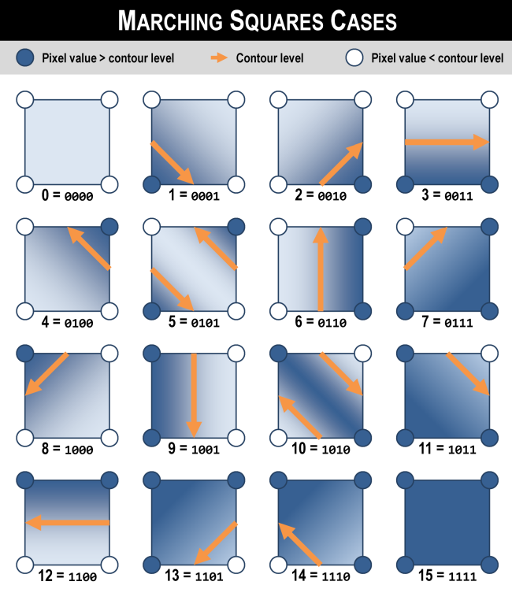

# Parallelized Generation and Smoothing of 2D Contour Lines

**CMU 15-618 Fall 2018 - Final Project Checkpoint Report**

**Dan Mahr (dmahr) and Justin Wang (jcwang1)**

Our project is about parallelizing the generation of contour lines. This is a common operation when visualizing a 2D scalar field. For example, topographic maps have contour lines generated from digital elevation models, where each line represents a path of equal elevation. While elevation contours are far from the only application of this problem, we have found them to be useful for building our intuition, there may be references to elevation scattered throughout this report.

## Progress on Goals and Deliverables

### Goal 1: Marching squares
Implementing the core marching squares algorithm was relatively straightforward. Given an input, (H x W) array of “pixels”, we define create an ((H - 1) x (W - 1)) array of “squares”. Each square is defined by its four corner pixels. For a given contour “level”, e.g. the 100 meter elevation line, each square falls into one of sixteen cases depending on which of its four corners are above or below the level.

For cases 0 and 15, all four pixels are above or below the level, so there is no contour boundary to add to that square (at that level). For the remaining cases, we need to add a segment which will eventually be part of a continuous contour line. For cases 5 and 10, we need to add two segments since the square is a “saddle”. The starting and endpoint points of each segment are calculated by linearly interpolating between the two pixel values on each edge. Note that the order of segment endpoints matters: we require that all segments be oriented such that the larger pixel value is always on the right hand side of the segment, e.g. contour lines always go clockwise around hills. This consistent orientation is crucial to our algorithm's correctness and efficiency.

Adding parallelization to marching squares is straightforward since each square can be processed independently by reading the four pixel values at its corners. We spatially decomposed the input array into “blocks” so that a thread handles all squares in one block within one iteration of the OpenMP parallel for loop. By using these square blocks with minimal perimeter-to-area ratio, we minimize the number of pixel values that have to be loaded from memory by multiple threads, improving temporal locality and reducing the number of duplicative reads. The size of one block is an optional command-line argument: in the figure above, the blocks are only 4 squares by 4 squares; our default block size is 32 squares by 32 squares.

### Goal 1/Goal 2: Segment joining

If the only goal is to graphically render contour lines, the embarrassingly-parallel marching squares algorithm above is sufficient, modulo some smoothing/anti-aliasing. But marching squares only returns an unordered collection of unconnected segments, each located at a square with a particular orientation. The continuous shape of contours across the whole raster is only apparent, visually, when all the individual segments are output together.

However, there are many applications when it is desirable to store contours in a more "global" line representation consisting of an ordered series of connected vertices. This includes geospatial vector formats used in GIS to store elevation contours, for example. This data format is more efficient since it eliminates duplicative vertices between adjacent segments and allows the use of more compact encoding schemes (e.g. bearing-distance). In addition, the linestring primitive enables more advanced line operations such as Douglas-Peucker simplification, densification, smoothing, topology enforcement, etc.

"Segment joining" is our name for the process of taking segments output by marching squares and joining together equal-level segments from adjacent squares into continuous contours. Our implementation performs a depth-first search on segments, traversing from one segment to a “neighbor” if and only if they are at the same level and the ending point of one matches the starting point of the other. A useful invariant is that the contour curves never branch or split, and thus the underlying graph for the search is just a collection of paths and/or simple cycles. This invariant, together with the notion of segment orientation discussed above, vastly simplifies the depth-first search.

Parallelizing segment joining is much more challenging than parallelizing marching squares. Because we want to return an *ordered* traversal of segments for each contour, there are dependencies between when segments can be processed. Thus, the most basic parallelism that preserves correctness is to assign all contours at a particular level to a single thread.. If contours are being generated at multiple levels (which is almost always the case), then we can parallelize across levels.

Due to its simplicity, parallelizing segment joining across levels is the only approach we've completely implemented and tested end-to-end. It is correct and shows modest, but far from ideal, speedup. One issue is workload imbalance: due to variations in elevation, some levels will have much longer contours than others. Even if workload is well balanced, the depth first search inherently leads to a multitude of memory access patterns. We are considering how to divide work in a way that is more cache-friendly.

## Preliminary Results

### Correctness evaluation

We considered spending time to learn GDAL interfaces to read arbitrary raster data, but this would take a lot of time. So let’s just use a super-simple text-based raster format ASCII Grid. Eventually, we hope to integrate the GDAL interfaces for accessing raster data so we can use larger input datasets. Right now, our inputs only contain about one million pixels in a 1000 by 1000 thousand grid. It is common in GIS applications to generate contours for digital elevation models with hundreds of millions of pixels. These larger test cases may also reveal different speedup characteristics.

In order to test the correctness of our code, we created a few sample input datasets. Early on, we used a tiny 21-by-21 grid [baby.txt](https://github.com/dmahr1/618-final/blob/master/inputs/baby.txt) with a simple circular pattern in order to incrementally evaluate the correctness of our implementation.

After achieving correct results with baby.txt, we created [cmu.txt](https://github.com/dmahr1/618-final/blob/master/inputs/cmu.txt) which contains a digital elevation model of the area around Carnegie Mellon. This was generated by clipping data from the National Elevation Dataset with GDAL and outputting an ASCII Grid file. Since our code scales and offsets the output contour lines based on the header, we can visualize the GeoJSON output in a viewer like [geojson.io](http://geojson.io/). As shown below, we are able to get compelling, correct contour lines. Moreover, our output was very nearly identical to GDAL’s contour lines, further confirming that our core marching squares logic is operating correctly.

### Performance evaluation with trig.txt

We generated a more complex, synthetic input dataset called [trig.txt](https://github.com/dmahr1/618-final/blob/master/inputs/trig.txt). As implied by its name, it is [generated](https://github.com/dmahr1/618-final/blob/master/inputs/generate_trig.py) from evaluating some trigonometric functions over a meshgrid. It was inspired by this [matplotlib example](https://matplotlib.org/gallery/images_contours_and_fields/pcolormesh_levels.html#sphx-glr-gallery-images-contours-and-fields-pcolormesh-levels-py). We used this for our midpoint performance evaluation because it was a sufficiently large and complex topology that could be generated quickly.

Phase 1 is when each thread runs the core marching squares algorithm for all squares in its block and individual segments are computed. Phase 2 is when each thread traverses the grid, joining together segments that lie at the same level. By default, we generate contours at 10 levels, determined by interpolating between the min and max values in the input dataset. In our baseline, serial implementation, phase 1 takes about 0.4 seconds and phase 2 takes about 1.8 seconds.

In phase 1, we achieved only a modest 2x speedup, regardless of the size of the blocks. Considering that marching squares is embarrassingly parallel, we concluded that our implementation of this phase is memory bound. In order to reduce memory overhead, we plan to restructure Phase 1 so that each thread joins all of its block’s segments across all levels into contour line “fragments”; this means that the producer and consumer of segment data is always the same thread, improving temporal locality.

In phase 2, we see a steady, albeit sub-linear speedup across levels. We also believe that this suffers from memory constraints, though not as severely as Phase 1, and that the aforementioned restructuring will dramatically reduce memory utilization in this phase.

### Performance with a space-filling contour line

Phase 2 parallelizes across levels when joining segments into contour lines. But what if a single level represents a disproportionate length of all contour lines? Worse yet, what if the contour line was a space-filling curve? We created the long.txt input dataset in order to test this adversarial scenario. As expected, when Phase 1 outputs segments that lie exclusively within a single level, parallelizing across levels in Phase 2 results in **no speedup**. This is a serious shortcoming with our current implementation.

Our forthcoming restructuring of our code to compute contour fragments within each block will partially mitigate this issue. In this revised approach, Phase 1 will parallelize across squares in the current block to write segment data to non-shared memory, Phase 2 will join segments for all levels in the current block into contour fragments, and Phase 3 will parallelize across levels to join contour fragments across different blocks. In the case of a single, space-filling contour line, the revised Phase 2 means that most of the segment joining can be done in parallel. The only serial portion in this adversarial case would be Phase 3 when one thread joins contour fragments across all blocks, which is much less work than joining segments across all blocks.

## Other Issues and Concerns

The performance of our program critically depends on all data (both input and intermediate) fitting in memory. We do not do any explicit management of how data moves between memory and disk, but suspect it would be bad for our program to be at the mercy of the OS, in memory-constrained situations. We are not sure where in the scope of our project the handling of such a scenario should go.

## Plan for Remaining Weeks and Poster Session

*Note: date represents the point at which we'd like the following to be done.*

- November 24 - Complete tiling/stitching code (Goal 2).

- December 1 - Begin smoothing code (Goal 3), evaluate performance on larger input, begin writing report.

- December 8 - Complete smoothing code (Goal 3), optimize for near-linear speedup (Goal 4), begin GDAL refactor for PR (Goal 5), run final benchmarks, progress on report.

- December 15 - Complete optimizations for near-linear speedup (Goal 4), complete final report, submit GDAL PR (Goal 5), poster session.

