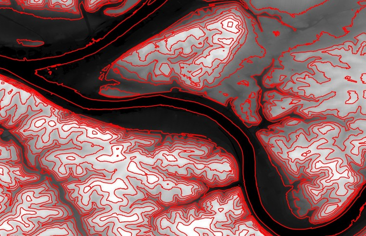
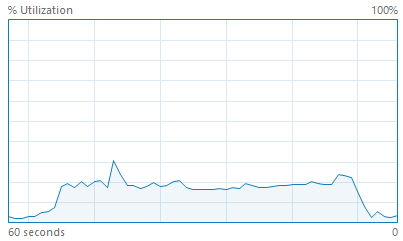
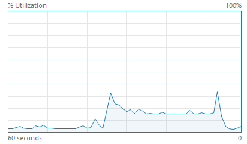
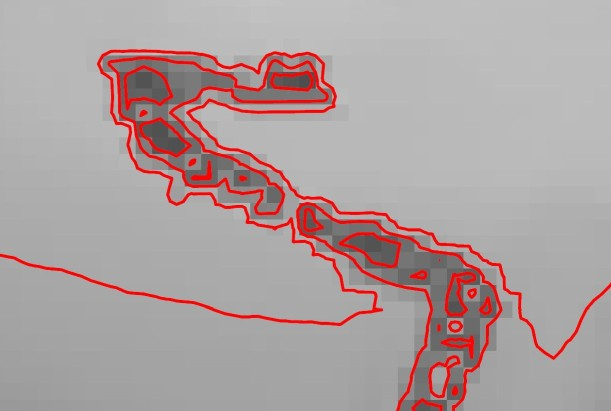

# Parallelized Generation and Smoothing of 2D Contour Lines

**CMU 15-618 Fall 2018 - Final Project Proposal**

**Dan Mahr (dmahr) and Justin Wang (jcwang1)**

[https://dmahr1.github.io/618-final/proposal.html](https://dmahr1.github.io/618-final/proposal.html)

## Summary

We are going to implement a parallel contour line generation program, a commonly used tool in geospatial libraries such as GDAL and ArcGIS. While the fundamental marching squares algorithm is amenable to parallelization, developing a parallel, external memory algorithm capable of partitioning inputs larger than memory and stitching their contours together into a single set of vector lines is non-trivial. We also plan to parallelize the smoothing of the resulting contour lines to produce a more aesthetically pleasing result.

## Background

Contour lines (also known as isolines, isopleths, or equipotential curves) are lines that join points of equal value in a multidimensional scalar field. In the common example of a topographic map (example shown below) the values in the 2D scalar field describe elevation, and contour lines join points of equal elevation, typically of a round interval such as 10 meters. This is a useful visualization technique in cartography, but also other technical fields where scalar fields are output, such as numerical modeling.

Pittsburgh elevation with 20-meter contour lines overlaid (i.e. lines denote 0 meters, 20 meters, etc.)

The classic algorithm for computing contour lines is known as “marching squares”, a riff on the 3-dimensional “marching cubes” algorithm described in Lorensen 1987. In marching squares, each pixel’s value is compared to that of its four cardinal neighbors. Since all cells are processed independently and the input scalar field is only read from, it is embarrassingly parallel. However, this assumes that the entire scalar field can fit into memory.

The Geospatial Data Abstraction Library (GDAL) is one of the most popular open-source geospatial libraries and lies at the core of QGIS, the most popular open-source desktop GIS software platform. Its current contour tool gdal_contour is capable of generating contour line data as a shapefile or other vector format from an arbitrary raster input. While its implementation uses marching squares, it does not utilize multi-core parallelism in any way. We confirmed this experimentally, as well: generating contours for a raster with 50 million elements took 44 seconds and utilized less than 20% of the CPU cycles on a quad-core hyper-threaded CPU (shown below). Experiments with the Contour tool in the commercial, closed-source ArcGIS platform also showed no use of multi-core parallelism, though we are unable to confirm this via source code. There is an obvious opportunity to speed up these tools using multi-core parallelism, and both GDAL and ArcGIS are realistic baselines to measure speedup.

Contour generation with GDAL (left) and ArcGIS Pro (right) does not utilize multi-core parallelism.

## The Challenge

The marching squares algorithm itself is very amenable to parallelism across pixels, as discussed above. However, this assumes that the entire input dataset can fit into memory. A digital elevation model of a large extent and/or high spatial resolution can easily run into the tens or hundreds of gigabytes, overwhelming most computers. In order to generate contour lines for an arbitrarily large input on commodity hardware, it will be necessary to partition the scalar field into tiles and generate contours vectors for each tile individually (i.e. parallelize across tiles). Then, the dangling contour lines from neighboring tiles must be paired and stitched together. Performing this memory-intensive stitching efficiently and in parallel is non-trivial and is similar to parallel joins of database tables.

Smoothing is another challenging aspect of our project. By default, contour lines can have sharp angles that are an artifact of the discretization of the input scalar field (see below). We would like to explore approaches for small-scale smoothing of the output contour lines so that it better describes the continuous surface from which the scalar field was discretized. Our shortlist of smoothing techniques includes Bezier interpolation, Chaiken’s algorithm (quadratic spline), cubic spline, and continuous local weighted averaging. Parallelizing smoothing across individual contour lines is particularly challenging since each can have an arbitrary number of vertices, almost certainly requiring a dynamic assignment scheme to achieve workload balance.

The discretization of the scalar field can cause artifacts in the contour lines.

An overarching challenge in this project is arithmetic intensity. Both marching squares and smoothing are relatively straightforward operations lacking the iterations of computationally expensive operations over which relatively slow memory accesses can be amortized. In order to attain a meaningful speedup, we will need to strategically use blocking, prefetching, and other techniques to avoid the memory bottleneck.

## Resources

We will write our contour line program from scratch. While it is tempting to use GDAL’s existing implementation as a starting point, we reconsidered based on feedback from the instructors about the difficulty that past students have had when contributing to open source libraries. Even so, one of our stretch goals in the following section is to refactor the code back to GDAL’s specification and submit a pull request.

To handle reading the input raster data and writing the output vector data, we plan to use GDAL’s C Raster API or a similar library. This is partially due to the well-known idiosyncrasies of the commonly used GeoTIFF and Shapefile formats, which are decades old.

To generate a set of test cases of varying size, we will mosaic digital elevation models from the National Elevation Dataset. Some inputs will be very small for debugging and initial testing, others will be larger but still fit in memory, and others will intentionally be tens of gigabytes such that they require use of the external memory algorithm described above.

## Goals and Deliverables

- **Goal 1:** Implement parallel marching squares contour line generation for inputs that fit in memory. This should parallelize across pixels in a way that utilizes all available CPU cores, unlike GDAL’s existing single-threaded implementation. Therefore, we expect a substantial speedup over GDAL, perhaps approaching a linear speedup. This is a goal we must achieve and is our first priority.

- **Goal 2:** Extend implementation to handle inputs that exceed available memory. This will require tiling the input raster data and stitching together the output vector lines. We hope that the overhead from these processes do not drastically lower speedup compared to inputs that do fit into memory. This is a goal that we plan to achieve and is a medium priority.

- **Goal 3:** Add parallelized smoothing of contour lines using one of the algorithms described above to generate densified, more aesthetically pleasing contour lines. This is a goal we plan to achieve and is a medium priority.

- **Goal 4:** Achieve close to ideal speedup on end-to-end generation of contour lines at high process counts, regardless of input size. This is a stretch goal that we hope to achieve if time allows. If we are unable to achieve a close to ideal speedup, we should attain a detailed understanding of the bottlenecks, e.g. cache capacity, memory latency, workload imbalance, etc.

- **Goal 5:** Refactor working code to GDAL’s API and specifications and submit a pull request to merge it with the existing codebase. This is a stretch goal that we hope to achieve if time allows.

- **Demo**: During the poster session, we will chart speedup and visualize contour lines for a number of inputs, perhaps with on-the-fly contour line generation for areas within Pittsburgh. We could also have a “taste test” where users compare the non-smoothed and smoothed contour lines.

## Platform

Our program will be written in C++ so it can easily access the GDAL C API for reading input data and writing output data.

We plan to use OpenMP to parallelize our program because the read-heavy workload involved in contour line generation is most amenable to a shared address space memory model.

Development will occur locally in order to best simulate typical usage by GIS analysts and developers.

## Schedule

- November 3 - Acquire and format test datasets, benchmark GDAL and ArcGIS, begin writing basic marching squares code (Goal 1).

- November 10 - Complete basic marching squares code (Goal 1).

- November 17 - Progress on tiling/stitching code (Goal 2), write checkpoint report.

- November 24 - Complete tiling/stitching code (Goal 2).

- December 1 - Begin smoothing code (Goal 3), begin writing report.

- December 8 - Complete smoothing code (Goal 3), optimize for near-linear speedup (Goal 4), begin GDAL refactor for PR (Goal 5), run final benchmarks, progress on report.

- December 15 - Complete optimizations for near-linear speedup (Goal 4), complete final report, submit GDAL PR (Goal 5), poster session.
