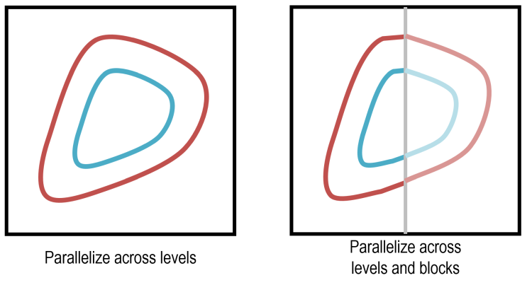
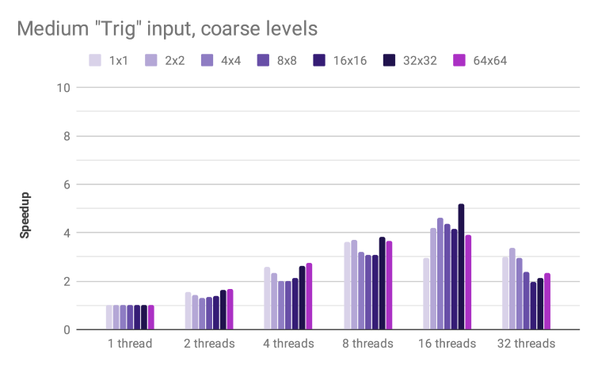
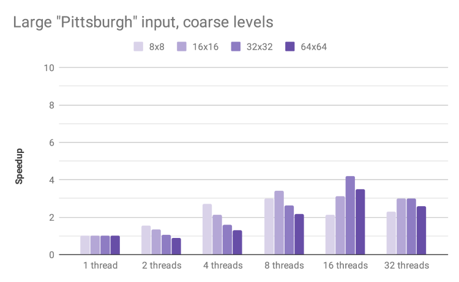
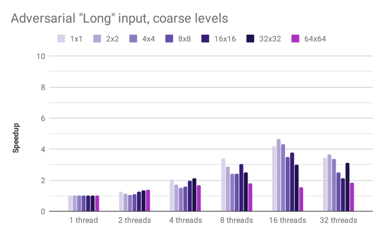
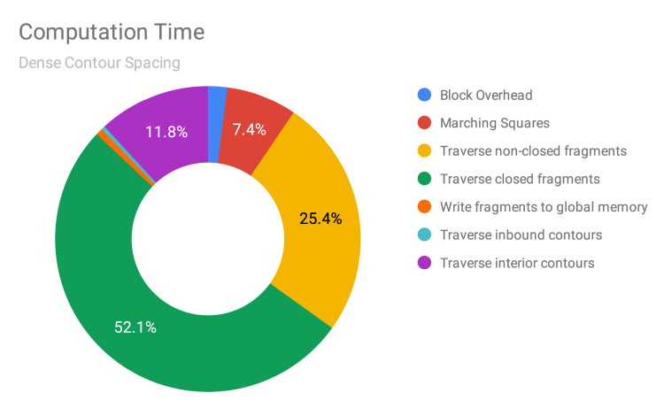

# Parallelized Generation and Smoothing of 2D Contour Lines

**CMU 15-618 Fall 2018 - Final Project Report**

**Dan Mahr (dmahr) and Justin Wang (jcwang1)**

[https://dmahr1.github.io/618-final/report.html](https://dmahr1.github.io/618-final/report.html)

# Summary

We implemented a parallelized 2D contour line generation program in OpenMP. While the fundamental Marching Squares algorithm for drawing each line segment is embarrassingly parallel, the process of joining line segments into arbitrarily long vectors is much more complex. By using blocked spatial decomposition and different dimensions of parallelism during different phases, we were able to achieve 9.5x speedup with 16 threads. This is a major improvement over popular open-source geographic information system (GIS) software which currently performs this single-threaded.

# Background

## Inputs and Outputs

Contour lines are a useful visualization technique for scalar fields. For example, topographic maps show contour lines generated from digital elevation models, where each line represents a path of constant elevation. Another example is numerical modeling, where scalar fields of pressure, stress, temperature, intensity, etc. are better visualized using contour lines. In all cases, tightly packed lines denote rapid change, while sparse lines denote little change.

The input data to generate contour lines is a 2D scalar field. In most cases, this is not an arbitrary collection of points, but a gridded array of evenly spaced pixels, where each pixel is the atomic unit of input data. In geographic information systems (GIS), it is not uncommon for the input digital elevation models to be very large: sections of the [USGS National Elevation Dataset](https://ned.usgs.gov/) are distributed as raster tiles, each around 60,000 by 80,000 pixels, or over 4 gigapixels per raster tile. Thus the performance of any contour line generation tool must function at scale.

Visually rendering contour lines for graphics purposes is a relatively straightforward process, as is discussed below. A more complex task is exporting these contour lines as an ordered series of connected vertices, which is the standard for geospatial vector formats used in GIS. This data format is more efficient since it eliminates duplicative vertices between adjacent segments and allows the use of more compact encoding schemes (e.g. bearing-distance). In addition, the linestring primitive enables other geospatial vector operations such as Douglas-Peucker simplification, densification, smoothing, topology enforcement, etc.

## Marching Squares

A **square** is a 2 x 2 array of pixels, where the center of each pixel is a vertex of the square. A **segment** is the atomic unit of a contour line and is a straight path between two vertices. Given an input raster and a particular contour **level**, the Marching Squares algorithm generates appropriate contour segment(s) that start and end on the sides of a square, if any.

There are two steps that go into determining a square. First, the value at each vertex is compared against the given contour level; based on which of its vertices are above or below the level, the square will fall into one of 24 = 16 possible cases. This determines the start and end sides for a segment. The specific coordinates of the start and end point are determined by linearly interpolating the contour level between the pixel values at either end of that side.

Marching Squares is embarrassingly parallel: each square's segments can be generated independently from all other squares. Thus, squares can be processed in whatever order is most efficient. In addition, the input raster only has to be read from (never written to), so there is no communication overhead.

## Segment Joining

After running Marching Squares, we have segments within each square. Our next algorithm, which we call *Segment Joining*, takes these segments as input and returns a set of continuous contours as output. Essentially, we just perform a traversal over consecutive segments which are at the same level. During this traversal, the ending vertex for one segment is the starting vertex for the next segment.

Since we want an ordered traversal of connected segments, there are dependencies between segments within a connected contour line. Certainly, if two segments are at different levels, then they cannot be part of the same contour. But we cannot tell *a priori* which segments at the same level belong to the same contour and which belong to disjoint contours. For example, in an elevation model with two separate hills that both cross the same elevation, their contour lines at this elevation are disjoint. Thus, based only on the output of Marching Squares, all segments at the same level are potentially, but not necessarily, dependent.

Due to these possible dependencies, attaining maximal parallelism during segment joining takes care. It is clear that we can parallelize across levels, but, as discussed above, this is overly pessimistic. If we somehow knew that two segments did belong to different contours, then we could safely conduct independent traversals from each. Unfortunately, we cannot know this without performing segment joining.

Our solution to attaining greater parallelism is decompose the input raster spatially into disjoint regions of squares, which we call **blocks**. As a simple example, consider a horizontal contour line running from left to right. If we partition the raster into left and right halves, then the fragments of the contour in each half may be traversed independently, so long as we perform an additional round of "fragment joining" along our partition boundary afterwards. Note that to correctly exploit this parallelism, we have an additional dependency: the joining of segments within a block must complete before the joining of segments across blocks.

Spatially decomposing the input raster into blocks decreases the workload imbalance that can occur with inputs whose contour lines are concentrated in a small number of levels. Given an input that resulted in only a single contour line e.g. a space-filling curve, parallelizing across levels only (illustrated on the left above) will assign all work to a single thread, resulting in no speedup! By parallelizing across blocks (illustrated on the right above), the work of joining segments at the same level can be performed in parallel by multiple threads. Later parallelization across levels will only have to join these fragments rather than all of their constituent segments.

The most performant block size is an open question; there are pros and cons associated with smaller and larger blocks. For these reasons, it is important for block size to be a tunable parameter.

- Smaller blocks ensure more balanced workload when parallelizing across blocks.
- Larger blocks ensure more balanced workload when parallelizing across levels.
- Smaller blocks are less likely to suffer from cache capacity misses due to their smaller memory footprint.
- Larger blocks take fewer total blocks to cover the same size raster, reducing overhead.

# Implementation

## Structure and Setup

Our parallel program can be decomposed into three main phases: (1) running Marching Squares over the input raster, (2) joining segments within each block into contour fragments, and (3) joining contour fragments into full contours. We devote a section to discussing the details of each phase. **Contour fragment** is our term for the intermediate sequences of points generated output by Phase 2.

We targeted CMU's GHC machines because we wanted to mimic the desktop workstation environment where most GIS analysts would be working with contour line data. We use the OpenMP API for C++ to develop our parallel program, because the shared memory model allows for lightweight dynamic work scheduling with multiple dimensions of parallelism. The hardware interoperability of OpenMP is well-suited to the variety of computers a GIS analyst might use, unlike a more niche, hardware-dependent runtime like CUDA.

Finally, an overarching concern of our design is that the entire process might be constrained by memory bandwidth. Compared to numerical simulations and other case studies we’ve examined this semester, contour line generation has a relatively small amount of computation per byte of input data. This low arithmetic intensity was one reason we chose not to target GPUs via CUDA or OpenCL. We took great care in our design in order to minimize the amount of memory traffic, even if that meant trading off for some additional computation.

To illustrate our implementation, let us consider a toy example of a 6 x 6 input elevation raster. This contains 5 x 5 squares, each defined by its border pixels.

## Phase 1: Marching Squares

In Phase 1, we decompose the raster into blocks and assign these blocks to hardware threads using an `omp parallel for` directive. We choose blocks to be square, because for a fixed block size, having square dimensions minimizes the total number of pixels which need to be read. More specifically, the use of square blocks maximizes the number of interior pixels, which in turn maximizes reuse of pixels within a block.

In our toy example, let us assume we have blocks that are 4 x 4 squares. The blocks at the end of each row and column may be truncated if the raster dimensions are not multiples of the block size.

To facilitate segment traversal in the later phases, we define a fixed orientation on segments. When traversing from a start point to an end point, higher values lie on the right hand side, e.g. contour lines always go clockwise around hills. This orientation invariant enables unique identification of a segment by the tuple containing its level and the the side from which it starts, which we pack into the `SegmentKey` struct.

Given the four pixel values around a square and a contour level, we run through Marching Squares, interpolating the starting and ending coordinates of the segment in accordance with the right hand rule above. Each segment is stored as an instance of the `Segment` struct. All segments for a given block are stored in one of two `std::unordered_map` objects that map `SegmentKey` structs to `Segment` structs. The first unordered map, called `inbound_segments`, stores only the small (or empty) subset of segments whose start point is on the edge of the block, i.e. are “inbound” to the block. The second unordered map called `interior_segments` stores the remaining segments. The motivation for this distinction is made clear in Phase 2.

In our toy example, Marching Squares adds a total of 14 segments across 13 squares, since one square falls into the “saddle” case which consists of two segments.

## Phase 2: Join Segments into Contour Fragments

In Phase 2, we again map blocks to hardware threads. We actually fuse the Phase 1 and Phase 2 operations into the body of a single `omp parallel for` directive. This allows the unordered_map objects generated in Phase 1 to actually stay local to the thread, which is strictly better in terms of memory traffic than if Phase 1 and Phase 2 were split into in distinct `omp parallel for` directives.

The contour fragments output by Phase 2 are ordered collections of points, built up by traversing segments and incrementally marking segments as visited. If a contour fragment is closed, i.e. it is a simple cycle that is entirely contained within the block, then the traversal can begin anywhere as long as it stops when it reaches the starting point at the end of the cycle. But if the contour fragment is not closed, i.e. it is part of a contour that spans multiple blocks, then the traversal’s starting point must be the inbound segment whose start point is on the edge of the block.

For this reason, the first step in Phase 2 is to join segments into non-closed contour fragments. Traversals occur starting from inbound segments stored in the unordered map `inbound_segments`; this traversal will likely mark a number of interior segments as visited as well. The second step of Phase 2 is to join any still unvisited segments into closed contour fragments. Traversals occur starting from interior segments stored in the unordered map `interior_segments` that were not already visited in the non-closed traversal. At the end of Phase 2, both the closed and non-closed contour fragments for each block are stored in a shared memory (i.e. non-local) data structure.

In our toy example, the segments within each block are joined into a total of four contour fragments. All four are non-closed since they start on the edge of the block.

## Phase 3: Join Contour Fragments into Contours

In Phase 3, we map levels to hardware threads. Instead of traversing across all segments in a block (regardless of level), each thread now only traverses across contour fragments at a particular level, but does so over all blocks in the raster. This is a different dimension of parallelism: unlike in going from Phase 1 to 2, where the output from Phase 1 could be kept thread-local, in going from Phase 2 to 3, a thread potentially needs to read all other threads' output from Phase 2. Here, we see a benefit from using the shared memory model.

After traversing all contour fragments, the resulting contour is atomically added to a global list using an `omp critical` directive.

In our toy example, the final contour is an “interior” contour since it does not begin on the edge of the raster. This is stored as a linked list of contour fragments to avoid having to copying the underlying points in memory.

## Simplification and Smoothing

The output contour lines can be very large depending on the size of the input raster, its characteristics, and the user-specified contour interval. This is because the output contour lines, no matter how straight they may be, still have one vertex from each of the segments that comprise it. One format-agnostic technique for reducing the output file is lossy simplification of the geometry.

The Douglas-Peucker algorithm simplifies geometric features and is a standard feature in GIS software. It performs this simplification by recursively processing a series of vertices and drawing a straight line between the starting vertex and the ending vertex. If all intermediate vertices lie within a narrow tolerance of the line, then they are removed. Else, the algorithm splits the series along the intermediate vertex that is farthest from the line, and recurses on each half.

The figure below demonstrates the output before (left) and after (right) applying simplification with a tolerance of 0.5. Even this modest simplification has the potential to reduce output file size by 80%.

  

One downside of Douglas-Peucker simplification is that the output contour lines become more jagged. There are a number of smoothing algorithms that add vertices so that corners are less abrupt. One of the simplest and most popular such algorithms in GIS software is Chaiken’s algorithm. This replaces every vertex of the original line string with two vertices: one that is one-quarter of the distance to the preceding vertex, and another that is one-quarter of the distance to the next vertex.

It is necessary to run perform simplification before smoothing in order to output reasonable results. The pairing of simplification (which removes vertices) and smoothing (which adds vertices) may seem unproductive. However, simplification typically removes many more vertices than are added by smoothing.

The figure below demonstrates the output before (left) and after (right) applying one round of Chaiken smoothing. Despite the addition of new vertices, the smoothed file is still 65% smaller than original output with neither smoothing nor simplification.

 

In our implementation, both simplification and smoothing, if specified in the command-line arguments, are carried out in the same omp parallel for block as Phases 1 and 2.

## Past approaches

Improvements over previous implementation that did not use blocks:

- By not traversing across the entire raster, there is less cache pollution.
- By not storing data in one unordered_multimap per square there is greater memory efficiency.
- By pre-joining segments into contour fragments we can safely parallelize traversal across levels without synchronization between blocks.
- By only working on the pixels in a reasonably-sized block we can improve cache locality, since the working set is more likely to fit into the cache.

## GDAL

GDAL is the Geospatial Data Abstraction Library and contains an [implementation of contour line generation](https://github.com/OSGeo/gdal/tree/master/gdal/alg/marching_squares). We examined this code in order to confirm our intuition of Marching Squares. However, this implementation is entirely single threaded despite the embarrassingly parallel nature of Marching Squares. The CPU utilization of an example run of GDAL on a quad-core hyper-threaded CPU is shown below. This choice was probably made due to the complexity of segment joining that we encountered in this very project.

We also used GDAL’s raster API in order to read arbitrary raster inputs, e.g. a GeoTIFF file, into memory as an array of floating point numbers.

# Results

## Experimental setup

All tests were run on one of the GHC machines, which have a dual-socket 8-core Xeon E5-1660 V4.

We measured speedup as the reduction in wall clock time relative to the single-threaded case. In order to focus on the computational speedup, we excluded the initialization step where the input raster was read from disk into memory, and the output step where the resulting contour lines were written from memory out to disk. This profiling was implemented using some lightweight instrumentation at a few key milestones in the codepath.

When evaluating the output simplification, we measured the ratio of the file size before and after applying simplification.

## Performance evaluation

The complexity of our implementation means that there are many dimensions along which to evaluate performance, including:

- **Thread count.** This is the axis along which we measure speedup. The ideal speedup is linear, e.g. a 16x speedup for 16 threads. However, parallelism overhead and Amdahl’s Law limits this.
- **Block size.** This defines the size of the spatial decomposition of the input raster. A given block is processed by only a single thread during Phase 1 and Phase 2. The pros and cons of small and large block size were discussed in the Background section.
- **Level density.** By default, the program generates contour lines at around 10 levels evenly spaced between the minimum and maximum raster values. We also experimented with a denser level setting that generated contour lines at around 100 levels.
- **Simplification.** The Douglas-Peucker simplification can dramatically reduce the output file size, at the cost of additional processing. This raises arithmetic intensity.
- **Smoothing.** This involves performing both Douglas-Peucker simplification and Chaiken smoothing, producing a smoother output at roughly the same file size. This also raises arithmetic intensity.

We performed a total of 936 test runs with various combinations of the above parameters using four different input datasets:

- The small `cmu.txt` raster is 394 x 312 and describes elevation around CMU.
- The medium `trig.txt` raster is 980 x 980 and describes a trigonometric function.
- The large `pittsburgh.geotiff` raster is 10613 x 5310 and describes elevation around the greater Pittsburgh metropolitan area.
- The adversarial `long.txt` raster is 100 x 100 but only contains a single, very long contour line.

In the charts below, we ran each test three times and report the speedup from the average of the wall clock time for Phases 1, 2, and 3.

### Speedup by thread count and block size for inputs of increasing size

For the small CMU input, our speedup levels off at 4 threads. The overhead of dynamic scheduling is not amortized over a sufficient number of blocks. In addition, the small input size increases the probability that key data structures remain in cache, improving performance for the single-threaded case and lowering speedup.

The medium Trig input exhibits a good speedup, reaching 6.7x for 16 threads and 32 x 32 blocks. The speedup decreases for 32 threads, likely due to the fact that the test hardware has 16 hyper-threaded cores and thus requires context switching in order for all 32 virtual cores to do useful work.

The larger Pittsburgh input shows a similar pattern, reaching 4.19x speedup for 16 threads. We could not reliably test this input with blocks smaller than 8 x 8 due to massive memory utilization for such a large array of STL containers.

### Speedup by thread count and block size for adversarial input

A major achievement with our approach of generating and joining contour fragments is robustness to the adversarial edge case of a single extremely long contour line. In earlier testing, this input degenerated into serial processing that exhibited zero speedup, even at high thread counts. This is no longer the case: we achieve a respectable 4x speedup with 16 threads.

### Speedup by thread count and block size for largest input and denser intervals

By using a larger set of levels that are more finely spaced between the raster’s minimum and maximum, more computation is performed during Phase 1 and Phase 2. The increased arithmetic intensity avoids saturation of the memory bus, meaning we can achieve a respectable 9.53x speedup with 16 threads and 64 x 64 blocks.

### Speedup by thread count and block size for largest input with simplification and smoothing

Douglas-Peucker simplification of contour fragments adds additional work in Phase 2. This may optionally be followed up with Chaiken smoothing. Both of these should increase arithmetic intensity and improve parallelism. However, we observe minimal increase in speedup: for 16 threads and 32 x 32 blocks, we observe 4.19x with neither simplification nor smoothing, 4.34x with simplification only, and 4.30x with both simplification and smoothing. This may be due to the overhead associated with resizing the vector of vertices during these operations.

### Speedup by thread count and block size for largest input with denser intervals, simplification, and smoothing

Simplification and smoothing have a small negative influence on speedup with the denser contour intervals. For 16 threads and 64 x 64 blocks, we observe 9.53x with neither simplification nor smoothing, 8.94x with simplification only, and 8.12x with both simplification and smoothing.

### Reduction in file size with different levels of simplification and smoothing

We analyzed the change in file size associated with simplification and smoothing on the large Pittsburgh input with dense contours. The original output file was nearly 500MB, but a very modest amount of smoothing with 0.1 tolerance reduced the output size by an impressive 57%. More aggressive smoothing reduced file size further (as much as 88% with 1.0 tolerance), albeit with some lossiness and jaggedness. Each round of smoothing produced a more aesthetically pleasing output, but at the cost of increasing the file size by approximately 1.8x.

## Analyzing Performance

We conclude by providing a more in-depth analysis of how our program's execution time is being spent. This provides a better understanding of our program's current performance and sheds light on possible future improvements.

We used a custom-built timing framework that allowed us to measure and categorize the duration of arbitrary components of the program . During regions of parallel execution, we were able to measure durations on a per-thread basis in addition to wall-clock time. As an example, we could add up the total amount of time a thread spent doing computation within a dynamically scheduled parallel for block. At the frequency with which we made calls into our timing framework, this instrumentation added very little overhead. Additionally, we used the Linux performance analysis utilities gprof and perf to gather further insights.

### Workload Balance

To understand workload balance, we break down how parallel execution time is spent on a per-thread basis. Recall that there are two `parallel for` blocks in our program: the first for fused phases 1 and 2, which is parallel across blocks; the second for phase 3, which is parallel across levels. We measured the time spent doing computation, synchronization (i.e. going to the shared work queue), and set-up/idling for each thread.

The figure above shows this breakdown for a medium-sized inputwith dense levels. When there are many more blocks and levels than threads, OMP's dynamic work scheduling allows us to achieve nearly perfect workload balance in both `parallel for` regions, as we observe very little idle time. Each unit of work is also large enough that threads are not contending on the shared work queue.

The figure above shows the breakdown for our adversarial `long.txt` workload, which contains a single long contour. In Phases 1 and 2, we observe reasonably good workload balance, as there are still many more blocks than threads, and each block contains some fragment(s) of the contour to be generated. Note that synchronization takes a slightly larger fraction of time (in that the bar for it is actually visible). This is because with only 1 level per block, the amount of work a thread does before it must consult the shared queue is smaller.

In Phase 3, though, we observe massive workload imbalance. This is to be expected, as we are parallelizing across levels, so only one thread will join together contour fragments for the single contour to be output. Fortunately, the fact most of the work has already been done in the form of joining segments into contour fragments in Phase 2 means that Phase 3 is relatively short. Admittedly, there are few real-world scenarios where contours are generated at only a single level. However, we believe this clearly illustrates the robustness and scalability of our parallel program against worst-case inputs.

### Component-by-Component Breakdown

Knowing that workload is balanced across threads, we now dive into how computation time is spent `within` a single thread. We ran our program on the medium-sized input with 16 threads. These figures only account for the parallel computation time and not serial regions such as loading the input file from disk to memory.

With regular contour spacing, we observe that time is primarily split evenly among four components: Marching Squares (Phase 1), traversing of non-closed fragments (Phase 2), traversing of closed fragments (Phase 2), and traversing of interior contours (Phase 3). The following detailed descriptions of what each component is spending time on comes from a combination of high-level reasoning about code and investigation of the `gprof`-generated call graph.

- **Marching Squares (Phase 1)**: This consists of reading the pixel values from memory, determining which of the 16 Marching Squares cases is appropriate, and adding any segments to either the thread-local `inbound_segments` or `interior_segments` map.
- **Traversing of non-closed fragments (Phase 2)**: This consists of iterating over the `inbound_segments` map and doing a traversal from each segment. Note that this is how most, if not all, segments in a block are traversed, as very few contours lie entirely within a single block. According to `gprof`, 98% of time is spent on the actual traversal.
- **Traversing of closed fragments (Phase 2)**: While logically similar to the traversing of non-closed fragments, this component is expensive for a different reason, because, as noted above, there are generally very few closed fragments. The difficulty is that every interior segment *might* be part of some closed fragment, but the only way to tell is iterate over the entire `interior_segments` map (which is much larger than the `inbound_segments` map) and check if each segment was visited or not during the traversal of non-closed fragments. According to `gprof`, only 40% of time is actually spent doing traversal, with the majority of time spent just iterating and checking segments.
- **Traversing of interior contours (Phase 3)**: This is expensive for reasons similar to the traversing of closed fragments (having to iterate over a map and check if fragments have been visited). However, there are also many more closed contours within the raster than closed contour fragments within a block, so a relatively greater portion of the time is also spent actually performing traversals.

In this breakdown, no component is an overwhelming bottleneck. However, the one that seems to provide the least gain for the work required is that of traversing closed fragments, as the proportion of closed fragments is small. Finding a better way of checking for interior fragments is a goal for improvement.

When we generate the same breakdown as above but with denser contours, the traversing of closed fragments becomes the bottleneck. This reinforces our belief that this component of our program is problematic and should be a priority when we try to improve it in the future.

Among the other three components, it makes sense that Marching Squares and traversal of interior contours take up a smaller share than before, relative to traversal of non-closed fragments ,because these components scale better when there are more levels. Clearly, that's the case for traversal of interior contours as, in Phase 3, we parallelize across levels. For Marching Squares, more levels means that more computation is performed for a given set of pixels read, i.e. we've increased the arithmetic intensity.

### Breakdown By Operation

To understand our program at the finest granularity, we profiled it using `perf`. Running a medium workload at various thread counts, we observe how the total number of CPU cycles breaks down based on type of operation. We describe the primary types of operations, which generally account for 75% of cycles:

- **Malloc/Free**: Cycles related to `malloc`, `free`, `_int_malloc`, `_int_free`, etc.
- **OMP overhead**: Cycles related to the shared object `libgomp.so.1.0.0`.
- **Hash Table**: Cycles related to `std::_Hashtable`.
- **Check Segment Visited**: Cycles related to checking if a segment has been visited, during traversal of interior contours.
- **Core Marching Squares**: Cycles related to reading pixels from memory and figuring out the appropriate Marching Squares case (but *not* actual construction of segments or insertion into maps, which fall under Malloc/Free and Hash Table, respectively).
- **Other**: GDAL, parsing flags, other miscellaneous things. Some likely could be categorized as one of the types above (so consider each band a lower bound) but were left out, because the process of parsing the output of `perf report` was done manually. However, all symbols which account for at least 2% of total cycles are categorized.

We observe that the breakdown of cycles by type of operation is fairly consistent even as we increase the number of threads. The main exceptions are OMP overhead (which is not surprising) and the cost of Malloc/Free in going from 1 thread to any larger number of threads. We discuss each type of operation and what it might suggest for scaling our program even better in the future:

- **Malloc/Free**: The significance of these operations is a concern, as these operations have poor-to-none arithmetic intensity. We initially thought having threads preallocate memory would make us end up with very sparse arrays, and we wanted to avoid such an inflated memory footprint. However, we failed to realize that having threads concurrently allocate memory during parallel execution would be a scalability bottleneck (even if the amount of memory is not too much). Looking at the disassembly of `malloc`, close to 70% of cycles and cache-misses within the function are spent on a single lock instruction, so threads are contending with each other while trying to allocate memory. While we still believe that preallocation would result in very sparse arrays, given the contention in our current approach, preallocation may be worth exploring further in the future.
- **OMP Overhead**: Unfortunately, because the OMP runtime is a prebuilt binary, we do not have debugging symbols, so have to speculate a bit about the details here. It could be the critical section in Phase 3. It also could be overhead for dynamic work scheduling that we improperly attributed as compute time above. We don't see it as a priority for improvement (especially because it does not explode when we go from 8 to 16 threads).
- **Hash Table**: Hash tables are known to have bad locality, a trade-off we thought was acceptable due to their lower memory footprint. As discussed above, some kind of sparse array approach might potentially do better.
- **Check Segment Visited**: The issues with this were already noted in discussing traversing of interior contour fragments. What *is* surprising is that while this takes up for a disproportionate number of cycles, it is not explainable purely in terms of cache-misses. If cycles were proportional to number of cache-misses, then there are a number of other places in our program that are worse than this in terms of cache-misses. What is true, though, is that this operation has the largest share of `perf`'s `stalled-cycles-backend` event (12-13%). However, understanding the details of this event might be moot, as we improve this operation were we to use some kind of sparse array.
- **Core Marching Squares**: This is not a focus at the moment, as a lot of the work may be unavoidable. A lot of cycles are spent determining the appropriate Marching Squares case, which is inherently branch-heavy and essential to correctness.

# Conclusion

We are very pleased with the results of our project. Despite the fact that the fundamental Marching Squares algorithm is embarrassingly parallel, the complexity required to actually join the segments into continuous vectors was a formidable challenge. In addition, we are proud to have attained a respectable 9.5x speedup for 16 threads even though the arithmetic intensity of Marching Squares is relatively low.  Finally, our deeper analysis confirms the effectiveness of many aspects of our design while also pointing out directions for future improvement.

# Distribution of work

Both students contributed equally to this project. Dan specialized in generating real-world elevation test cases, creating the GeoJSON output function, developing the profiling system, executing tests, and adding GDAL raster file reading. Justin specialized in creating the adversarial and trigonometric test cases, developing the contour fragment and contour traversals, adding Chaiken smoothing, adding Douglas-Peucker simplification, and gathering data for the deeper analysis. Both students contributed to the implementation of the core Marching Squares algorithm, the design of the blocked contour fragment traversal scheme, code reviews, and writing the report.

